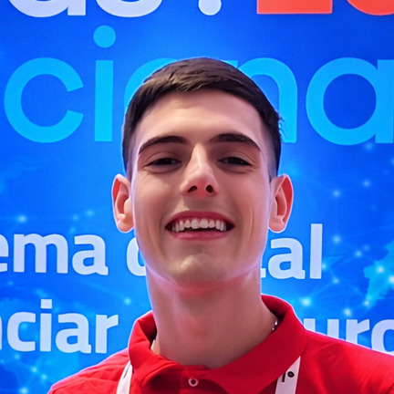
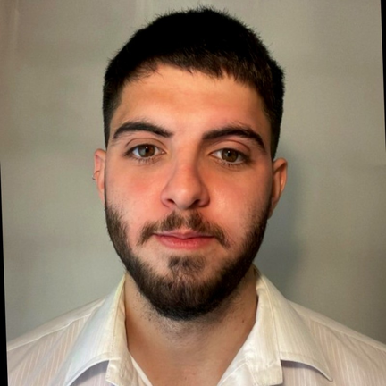
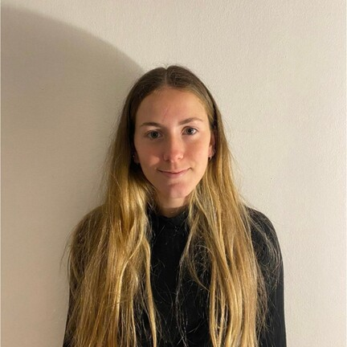
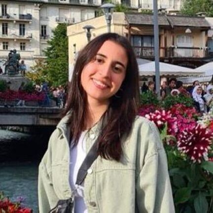

# 👨‍💻 FIUBA - Gestión del Desarrollo de Sistemas Informáticos - Grupo 1

Bienvenidos al espacio de trabajo del **Grupo 1** de la materia **Gestión del Desarrollo de Sistemas Informáticos - Fontela (FIUBA)**.

Aquí centralizamos el código y la documentación de nuestros proyectos.

## 📌 Información de la materia
📍 Universidad de Buenos Aires – Facultad de Ingeniería 

📚 Materia: Gestión del Desarrollo de Sistemas Informáticos

📅 Año: 2025

## 🎯 Objetivos de la Organización

- Desarrollar una plataforma web inspirada en TripAdvisor, incorporando nuevas funcionalidades diferenciadoras como la gestión de viajes en grupo, un sistema de recompensas por puntaje y la generación automática de itinerarios mediante herramientas de IA.
- Aplicar buenas prácticas de gestión de proyectos de software, incluyendo la planificación iterativa, análisis de riesgos, gestión de cambios y la validación continua del producto con el cliente.
- Fomentar la creación de artefactos documentales que respalden el proceso de desarrollo (Cronogramas, MVPs, reportes de validación y entregables semanales).
- Promover la colaboración interdisciplinaria y la gestión de equipos, simulando la dinámica y las responsabilidades de un proyecto real en un entorno profesional. 

## 👥 Integrantes del Grupo 1

<table>
  <tr>
    <td align="center" width="220px">
       
      <b>Ascencio Felipe Santino</b> 
      🎓 Padrón: 110675 
      📧 fascencio@fi.uba.ar
    </td>
    <td align="center" width="220px">
       
      <b>Guerrero Martín</b> 
      🎓 Padrón: 107774 
      📧 mguerrero@fi.uba.ar
    </td>
    <td align="center" width="220px">
       
      <b>Landi Agustina</b> 
      🎓 Padrón: 107850 
      📧 alandi@fi.uba.ar
    </td>
  </tr>
  <tr>
    <td align="center" width="220px">
       
      <b>Slepowron Majowiecki María Mercedes</b> 
      🎓 Padrón: 109454 
      📧 mslepowron@fi.uba.ar
    </td>
    <td align="center" width="220px">
       
      <b>Suárez Pino Imanol</b> 
      🎓 Padrón: 107746 
      📧 isuarezp@fi.uba.ar
    </td>
    <td align="center" width="220px">
       
      <b>Valdatta Catarina</b> 
      🎓 Padrón: 110533 
      📧 cvaldatta@fi.uba.ar
    </td>
  </tr>
</table>

